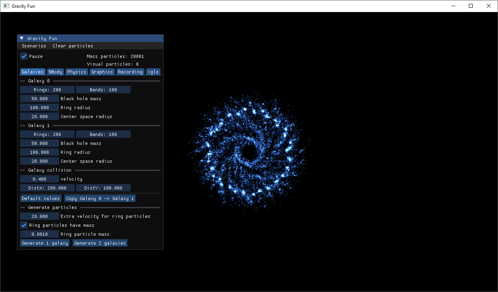
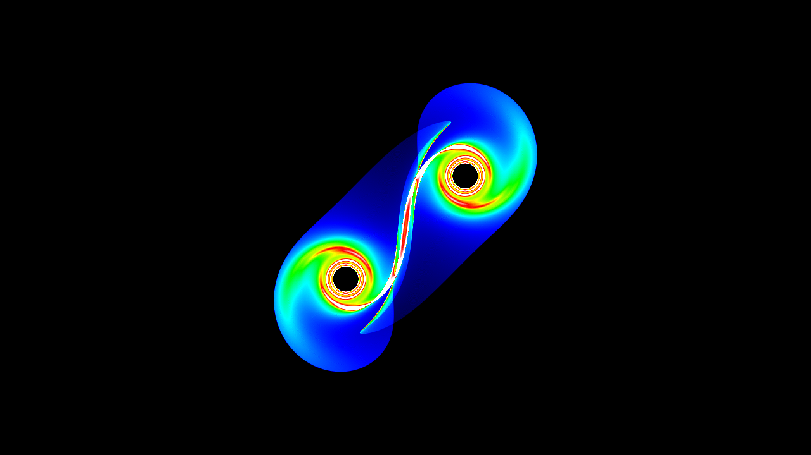
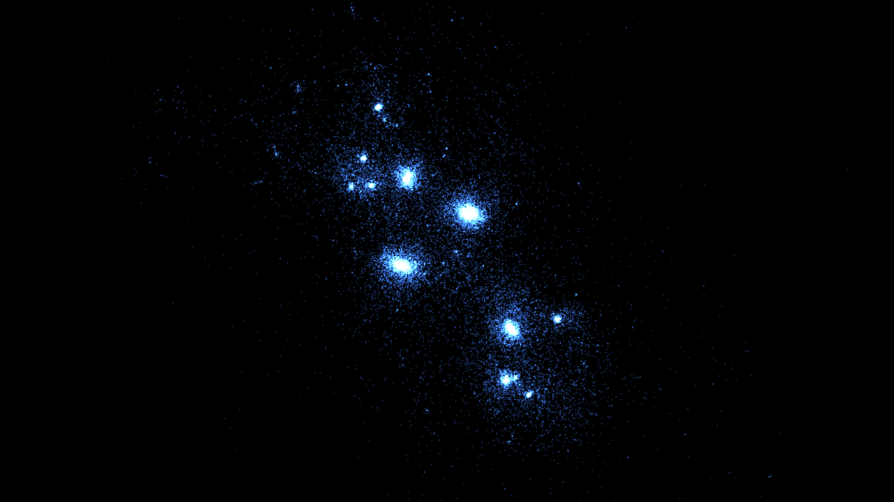
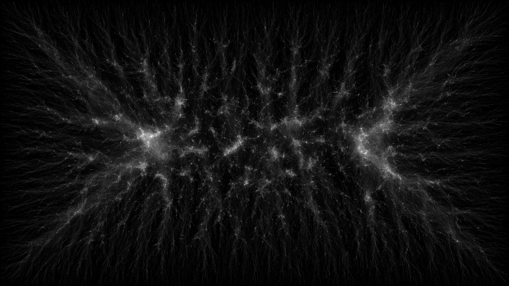

# Gravity Fun

## About the project

Gravity Fun is an interactive 2D n-body simulator.
This is a personal programming project I created just for fun.
My rendering abstraction layer [iglo](https://github.com/c-chiniquy/iglo) is used, with D3D12 serving as the rendering backend.

## Features

- Modern CS_6_6 compute shaders.
- Multiple premade scenes to choose from.
- All simulation parameters are modifiable.
- Supports two particle types
  - Mass particles: Has mass and can affect other particles.
  - Visual particles: Cannot affect other particles, but has less computational time complexity.
- Supports recording simulations as .PNG image sequences.
- Multiple rendering methods to choose from.
- You can interact with the particles using your cursor.

## Gallery








## Minimum system requirements

- Windows 10 (version 1909 or later)
- Shader model 6.6 capable graphics card and graphics drivers

## Build on Windows

- Install [CMake](https://cmake.org/download/). Version 3.22 or higher is required.
- Ensure CMake is accessible from the command line. 
- For Visual Studio: Run `build.cmd`. Generated project files will appear in `/build/`. 
- For other:
  ```
  cmake -B build
  cmake --build build --config Release
  ```
- CMake will automatically download Agility SDK if needed and place it in the build folder.

## Third Party Libraries

- [iglo](https://github.com/c-chiniquy/iglo)
- [ImGui](https://github.com/ocornut/imgui)
